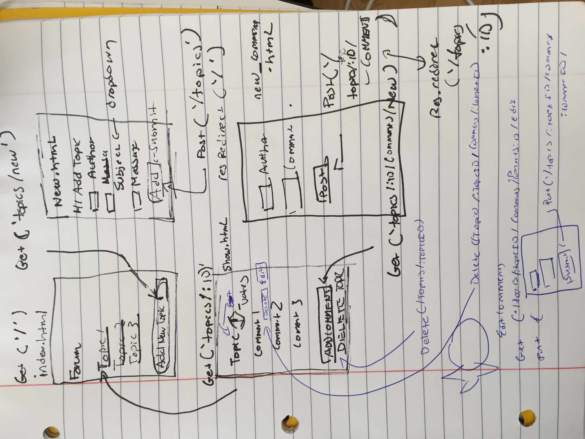

#ReadMe

##User Stories
- A user goes to homepage and sees a list of posts ordered by popularity
- There is a link a user can click on the homepage to create a new Topic
- This brings them to a form page to fill out Post Information
- They will be text inputs.  Once they submit a topic they will be redirected to Homepage where it lists all the topoics
- If they click on the topic they can see a list of the comments
- On that page someone can click a link that brings them to a page to add a new comment
- A user will be able to click a vote button which will give the topic another vote
- They can't vote more than once

## Feature Specs
- Technologies to be used: JS, Node, SQLITE3, SQL
- Will have forms to create a new Topic and another to create comments
- User can edit a topic
- User will not be able to delete comment
- User can delete a Topic

## SQL Table Setup
CREATE TABLE categories (
      id integer PRIMARY KEY autoincrement,
      name varchar(255) NOT NULL
);

CREATE TABLE threads (
    id integer PRIMARY KEY autoincrement,
    user varchar(255) NOT NULL,
    message varchar(255) NOT NULL,
    votes integer,
    category_id integer NOT NULL,
    FOREIGN KEY(category_id) REFERENCES categories(id)
);

CREATE TABLE comments (
    id integer PRIMARY KEY autoincrement,
    author varchar(255) NOT NULL,
    comment varchar(255) NOT NULL,
    topic_id integer NOT NULL,
    FOREIGN KEY(topic_id) REFERENCES topics(id)
);

## Routes
- app.get(/) Renders Index Page
- app.get(/categories/:category_id/threads) Renders all threads for a corresponding topic
- app.get(/categories/:cat_id/threads/:thread_id) Render comments within thread
 app.get(/categories/:cat_id/threads/:thread_id/comments/new/) renders new thread form
- app.post(/categories/:cat_id/threads/:thread_id/comments") post request to submit a new comment
- app.get(/categories/:cat_id/threads/new) get request to render new thread form
- app.post(/categories/:cat_id/threads) Post request to add a new thread
- app,put(/categories/:cat_id/threads/:thread_id) adds or decreases a vote on a thread
- app.delete(/categories/:cat_id/threads/:thread_id/comments/:comment_id)

- app.delete(/categories/:cat_id/threads/:thread_id) delete a thread

##WIREFRAMES

##PseudoCode
- Set up App.Listen on popularity
- Set up dependencies and install modules
- Set up Get Request to render Home Page
- Set up Get Request to render Topics Page for category
- Set up Get Request to render new Topics form
- Set up post Request for new Topic
- Set up Get Request to render Delete Requests
- Set up get Request to render new Comments form
- Set up post Request for new comments
- Set up Put request to edit Comments
